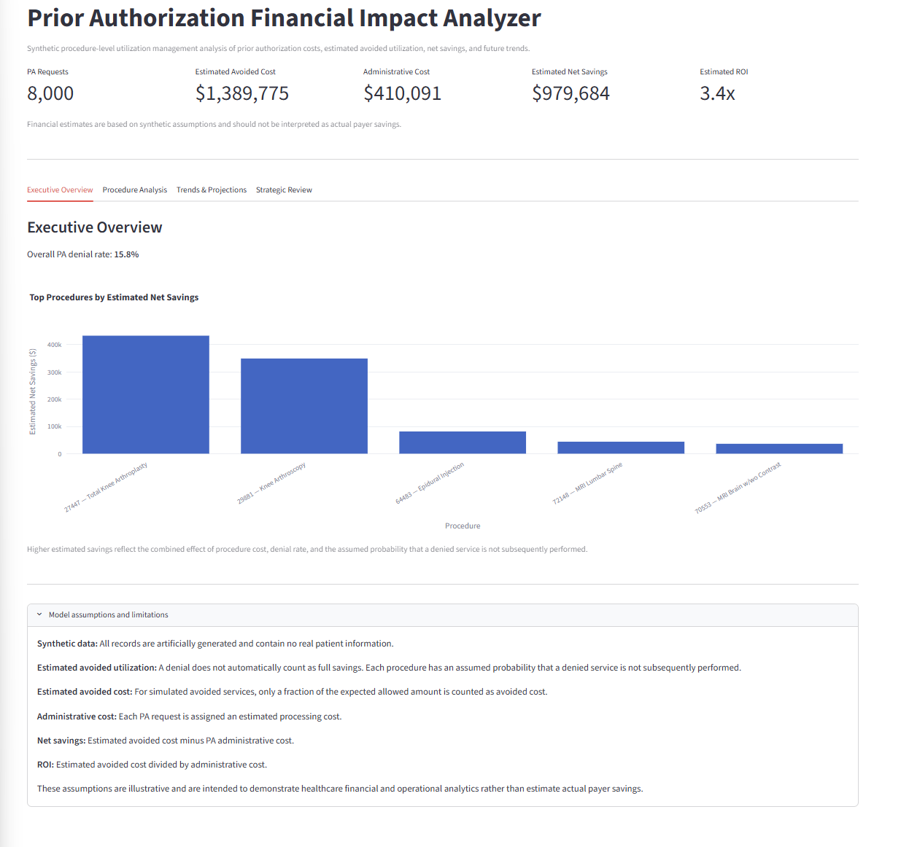
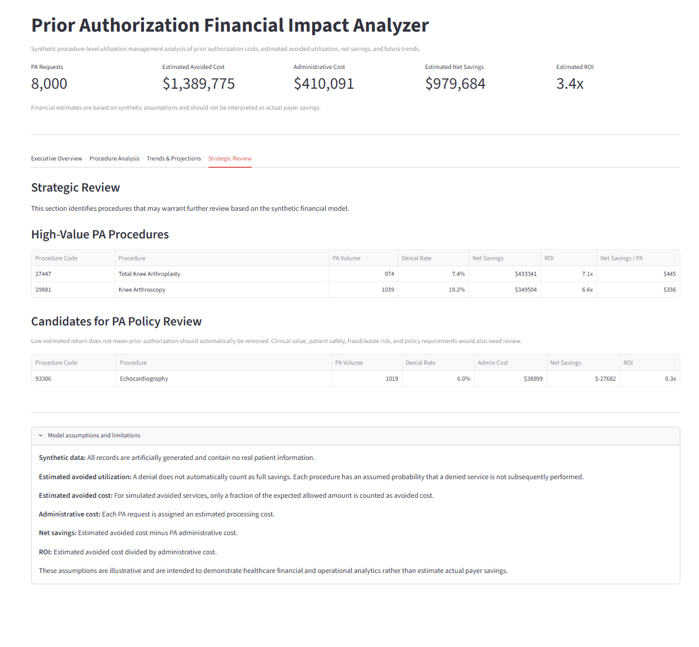
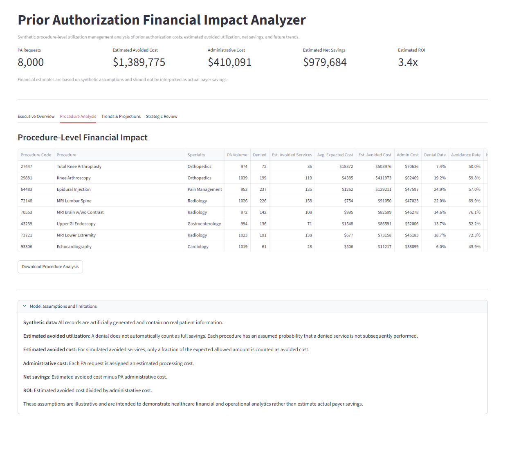
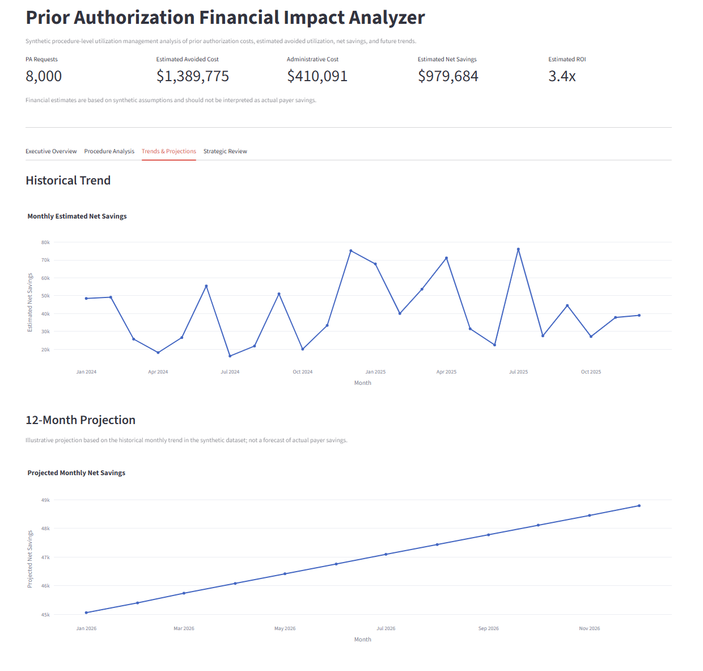

# Prior Authorization Financial Impact Analyzer

A Python-based healthcare analytics application that models procedure-level prior authorization utilization, administrative cost, estimated avoided cost, net savings, ROI, historical trends, and future projections using synthetic claims data.

The project demonstrates how healthcare utilization management and medical policy data can be translated into financial and operational insights for strategic decision-making.

## Executive Dashboard

## Key Capabilities

- Analyzes prior authorization activity at the procedure-code level
- Calculates denial rates and estimated avoided utilization
- Estimates avoided cost and administrative cost
- Calculates net savings and ROI
- Identifies higher-value prior authorization procedures
- Flags procedures that may warrant policy review
- Analyzes historical monthly trends
- Generates illustrative 12-month projections
- Provides downloadable procedure-level analysis

## Strategic Review

The application identifies procedures with stronger estimated financial returns and procedures that may warrant further policy review.

## Procedure-Level Analysis

## Trends & Projections

## Methodology

The application uses synthetic procedure-level healthcare claims and prior authorization data. Financial impact is estimated using:

- Prior authorization volume
- Denial rates
- Expected procedure cost
- Estimated avoided utilization
- Administrative processing cost
- Net savings
- Return on investment (ROI)

The projection component uses historical synthetic monthly trends to generate an illustrative forward-looking estimate.

## Technology

- Python
- Pandas
- Streamlit
- Plotly
- scikit-learn

## Project Structure

    app.py                  Streamlit application
    generate_data.py        Synthetic healthcare data generator
    data/                   Synthetic claims dataset
    src/
        analytics.py        Financial and utilization analytics
        projections.py      Trend and projection logic
    screenshots/            Application screenshots
    requirements.txt        Python dependencies

## Running the Application

Install dependencies:

    pip install -r requirements.txt

Run the application:

    streamlit run app.py

## Data & Limitations

All data used in this project are artificially generated and contain no real patient information.

Financial estimates are illustrative and are intended to demonstrate healthcare financial, utilization management, and operational analytics. They should not be interpreted as actual payer savings or recommendations to add or remove prior authorization requirements.

Clinical value, patient safety, fraud/waste risk, regulatory requirements, and medical policy considerations would require additional evaluation in a real-world implementation.
